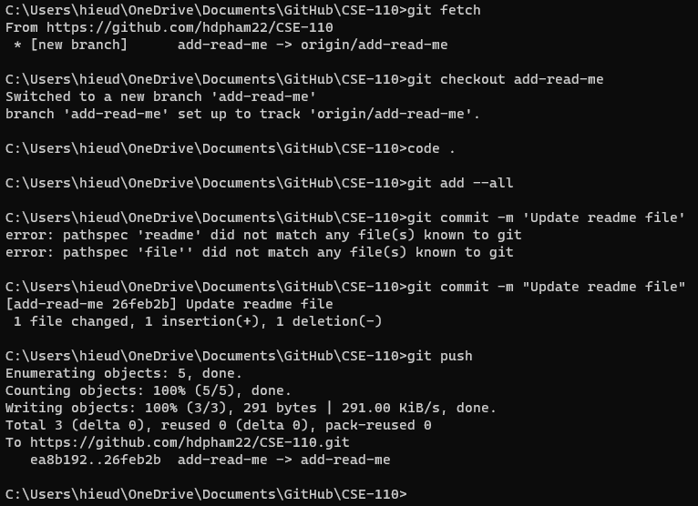
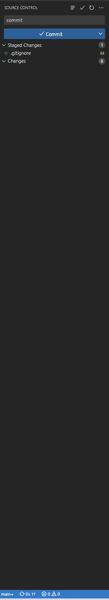

# Welcome to My First Website! <br>
## Header 2

**hello world!** <br>
My name is *Hieu Pham* <br>
[Please Click This](https://drive.google.com/file/d/1Zn_rc64Q5OETLAZwKqm_A4zz0duQNuHW/view?usp=sharing) <br>

[Now Click This](http://i.imgur.com/jl8WoEc.jpg) <br>
>Blockquote
* list1
* list2
* list3
1. One
2. Two
3. Three
'Inline code' blah blah <br>

```
# code block
print '3 backticks or'
print 'indent 4 spaces'
```

---

 <br>
 <br>

Click [Header2](#header-2) to open the  first heading.<br>
[a relative link](Screenshots/GitCommands.png)

- [x] Headings
- [x] Styling text
- [x] Quoting text
- [x] Quoting code
- [x] External links
- [x] Section links
- [x] Relative links
- [x] Ordered and unordered lists
- [x] Task lists